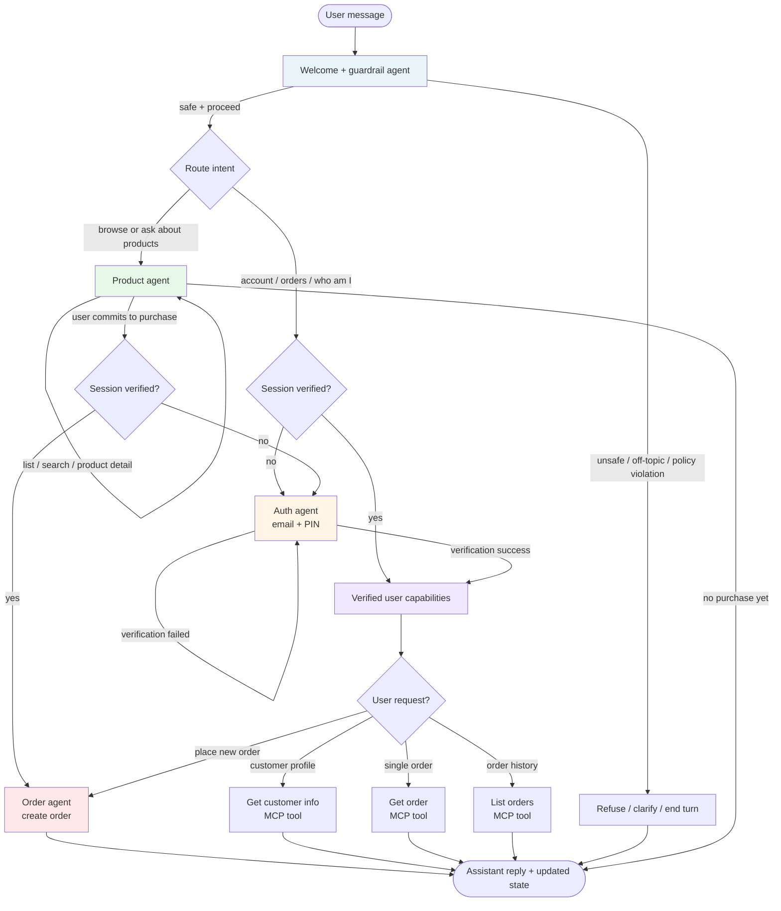

FastAPI + LangGraph chat with an Angular SPA in the same Docker image (`runtime-full`). **The YAML block above must stay at the very top of this file** — Hugging Face Spaces reads it for `sdk: docker` and routing to port `8000` (same as `uvicorn` in the `Dockerfile`).

## Hugging Face Spaces

1. [Create a Space](https://huggingface.co/new-space) with SDK **Docker**, or push this repo to an existing Space.
2. **Settings → Secrets:** `OPENROUTER_API_KEY`, `OPENROUTER_HTTP_REFERER` (your Space URL), and optionally `MCP_SERVER_URL`.
3. Health check: `/api/health`.

## Agent flow

